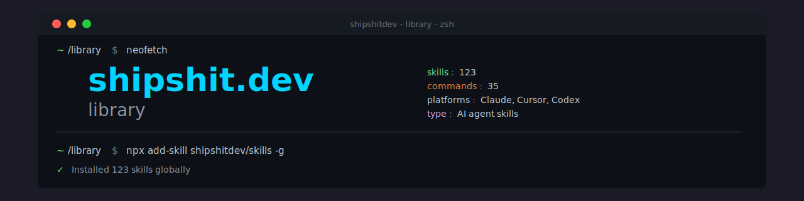

# Ship Shit Dev Skills


158 AI agent skills for indie developers. Works with Claude Code and OpenAI Codex.

## Directory Structure

```
skills/
├── skills/              # All skills (160)
├── commands/            # All commands (35)
├── bundles/             # Generated marketplace bundles
├── .agents/             # Repo management, memory, meta-skills
│   ├── SYSTEM/          # Architecture docs, skill standards
│   ├── memory/          # Repo decisions and context
│   └── skills/          # Meta-skills for maintaining this repo
├── .claude/             # Claude Code config (agents, rules)
├── .codex/              # Codex CLI config
└── scripts/             # Validation, generation, migration
```

## What's Included

- **Skills**: Specialized agent capabilities for specific domains (e.g., `stripe-implementer`, `nestjs-expert`)
- **Commands**: Workflow commands for structured tasks (e.g., `code-review`, `deploy`, `mvp-plan`)
- **Scripts**: Validation, generation, and migration tooling

## Installation

### Quick Install (Recommended)

```bash
# Install all skills globally for Claude Code and Codex
npx skills add shipshitdev/skills -g --agent claude-code codex --skill '*' -y

# Install specific skills
npx skills add shipshitdev/skills -g --skill stripe-implementer -y

# List available skills
npx skills add shipshitdev/skills --list
```

> **Do NOT use `--all`** — it installs to every agent the CLI knows about (30+).
> Always use `--agent` to target only the agents you use.

### Project-local Install

```bash
npx skills add shipshitdev/skills --agent claude-code codex
```

### Claude Code Plugin (Alternative)

```bash
/plugin marketplace add shipshitdev/skills
/plugin install shipshitdev-startup@shipshitdev    # or any category bundle
```

### For Contributors

```bash
git clone https://github.com/shipshitdev/skills.git ~/shipshitdev-skills
cd ~/shipshitdev-skills
npx skills add . -g --agent claude-code codex --skill '*' -y
```

## Adding Skills & Commands

### Adding a Skill

1. Create directory in `skills/skill-name/`
2. Add `SKILL.md` with YAML frontmatter
3. Update this README

```bash
mkdir -p skills/my-skill
touch skills/my-skill/SKILL.md
```

### Adding a Command

1. Create `.md` file in `commands/`
2. Follow naming: `{verb}-{noun}.md`
3. Update this README

## Documentation

- `.agents/SYSTEM/SKILL-STANDARDS.md` - Agent Skills spec + Claude Code extensions
- `.agents/SYSTEM/SKILL-MANAGEMENT.md` - Single-source skill workflow
- `.agents/SYSTEM/ARCHITECTURE.md` - .agents folder structure
- `.agents/SYSTEM/PLATFORM-ADAPTATIONS.md` - Claude vs Codex writing guide

## Commands

| Command | Description |
|---------|-------------|
| analyze-codebase | Codebase analysis |
| api-test | API test generation |
| bug | Bug capture workflow |
| check-domain | Domain name generator & availability checker |
| clean | Cleanup workflow |
| code-review | Code review |
| db-setup | MongoDB/Redis setup |
| de-slop | Clean AI code artifacts |
| deploy | Deployment workflows |
| docs-generate | Documentation generation |
| docs-update | Documentation updates |
| end | End session |
| env-setup | Environment variables |
| inbox | Process inbox items |
| launch | Launch workflow |
| migrate | Database migrations |
| monitoring-setup | Sentry/Analytics setup |
| mvp-plan | MVP planning |
| new-cmd | Create new commands |
| new-session | Create session files |
| optimize-prompt | Prompt optimization |
| performance | Performance analysis |
| quick-fix | Quick fixes |
| refactor-code | Code refactoring |
| review-pr | PR review |
| scaffold | Project scaffolding |
| security-audit | Security audit |
| start | Start session |
| task | Task management |
| test | Test tracking |
| validate | Validation workflow |

## Skills (158)

### Startup (14)

`business-model-auditor`, `cofounder-evaluator`, `constraint-eliminator`, `early-hiring-advisor`, `execution-accelerator`, `execution-validator`, `fundraise-advisor`, `idea-validator`, `market-sizer`, `mvp-architect`, `offer-architect`, `offer-validator`, `pricing-strategist`, `startup-icp-definer`

### Sales (13)

`channel-validator`, `competitive-intelligence-analyst`, `email-finder`, `funnel-architect`, `funnel-validator`, `lead-channel-optimizer`, `leads-researcher`, `outbound-optimizer`, `partnership-builder`, `retention-engine`, `support-systems-architect`, `traffic-architect`, `traffic-validator`

### Marketing & CRO (1)

`x-algorithm-optimizer`

### Branding (5)

`brand-architect`, `expert-architect`, `expert-validator`, `positioning-angles`, `search-domain-validator`

### Content (9)

`changelog-generator`, `content-creator`, `copy-validator`, `copywriter`, `docs`, `humanizer`, `internal-comms`, `nextra-writer`, `youtube-video-analyst`

### Planning (7)

`analytics-expert`, `business-operator`, `cto-advisor`, `roadmap-analyzer`, `rules-capture`, `strategy-expert`, `task-prd-creator`

### Frontend & React (28)

`accessibility`, `ai-loading-ux`, `clarify`, `component-library`, `critique`, `design-consistency-auditor`, `expo-architect`, `frontend-design`, `html-style`, `landing-page-vercel`, `layout`, `micro-landing-builder`, `nextjs-validator`, `polish`, `quick-view`, `quieter`, `react-component-performance`, `react-hook-form`, `react-native-components`, `react-patterns`, `react-refactor`, `react-testing-library`, `shadcn`, `shadcn-setup`, `table-filters`, `tailwind`, `tailwind-validator`, `theme-factory`

### Backend & Data (9)

`api-design-expert`, `error-handling-expert`, `graphql-architect`, `incremental-fetch`, `nestjs-expert`, `serializer-specialist`, `turborepo`, `typescript-expert`, `typescript-refactor`

### Infrastructure (10)

`aws-infrastructure`, `docker-expert`, `ec2-backend-deployer`, `mongodb-atlas-checker`, `mongodb-migration-expert`, `monitoring-setup`, `nestjs-queue-architect`, `performance-expert`, `security-expert`, `workflow-automation`

### Payments (2)

`financial-operations-expert`, `stripe-implementer`

### Security (1)

`security-audit`

### Testing (6)

`husky-test-coverage`, `nestjs-testing-expert`, `playwright-e2e-init`, `qa-reviewer`, `testing-cicd-init`, `testing-expert`

### AI Agents (13)

`advanced-evaluation`, `agent-browser`, `comment-mode`, `context-degradation`, `context-fundamentals`, `context-optimization`, `evaluation`, `mcp-builder`, `memory-systems`, `multi-agent-patterns`, `skill-creator`, `spec-first`, `tool-design`

### Dev Workflow (18)

`agent-config-audit`, `analyze-codebase`, `audit`, `claude-code-guide`, `code-review`, `commit-summary`, `de-slop`, `debug`, `deploy`, `llm-structured-output`, `prompt-engineering`, `refactor-code`, `review-pr`, `scaffold`, `session-end`, `session-start`, `shape`, `skill-capture`

### GitHub (3)

`gh-address-comments`, `gh-fix-ci`, `git-safety`

### Session Management (4)

`agent-folder-init`, `ai-dev-loop`, `session-documenter`, `workspace-performance-audit`

### Workspace Setup (12)

`artifacts-builder`, `biome-validator`, `bun-validator`, `clerk-validator`, `content-script-developer`, `devcontainer-setup`, `fullstack-workspace-init`, `linter-formatter-init`, `open-source-checker`, `package-architect`, `plasmo-extension-architect`, `project-init-orchestrator`

## How Skills Adapt to Projects

Skills are **adaptive** - they scan project documentation to understand:

- Project architecture and structure
- Brand voice and tone
- Existing patterns and conventions
- Terminology and style

If a project has its own skill, the generic skill will collaborate with or defer to it.

## Publishing & CI/CD

When you push to `master`, GitHub Actions automatically regenerates the `bundles/` directory to keep marketplace plugins in sync with skills.

### Claude Marketplace

Users install directly from GitHub:

```bash
# Add the marketplace
/plugin marketplace add shipshitdev/skills

# Install category bundles
/plugin install shipshitdev-startup@shipshitdev
/plugin install shipshitdev-testing@shipshitdev
/plugin install shipshitdev-frontend@shipshitdev
```
