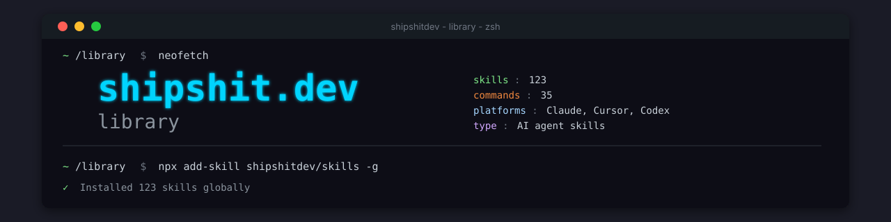

# Ship Shit Dev Skills


<!-- catalog-summary:start -->
176 AI agent skills for development workflows. Works with Claude Code, OpenAI Codex, and Cursor.

Catalog: **176 skills · 24 commands · 13 bundles · 189 plugins**.
<!-- catalog-summary:end -->

Skills are **model-agnostic playbooks**: the harness supplies the model, so no skill names a concrete model — orchestrators speak in capability tiers, and each repo's routing block maps tiers to models. Enforced by `scripts/validate-skill-sync.sh`; standards live in `.agents/memory/system/skill-standards.md`.

## Directory Structure

<!-- catalog-layout:start -->
| Path | Role | Generated fact |
|---|---|---|
| `.agents/` | Repository memory, standards, and maintenance skills | Tracked |
| `.claude/` | Claude loader adapters for shared maintenance content | Tracked |
| `.claude-plugin/` | Generated Claude marketplace catalog | 189 generated plugins |
| `.codex/` | Codex loader adapters for shared maintenance content | Tracked |
| `.github/` | Issue templates and GitHub Actions workflows | Tracked |
| `.husky/` | Git hook configuration | Tracked |
| `.tmp/` | Tracked repository content | Tracked |
| `assets/` | Static repository assets | Tracked |
| `bundles/` | Generated marketplace bundle snapshots | 13 generated bundles |
| `commands/` | Claude Code/plugin command adapters | 24 command adapters |
| `docs/` | Human-facing orientation pages for flagship skills | Tracked |
| `prompts/` | Shared prompt resources | Tracked |
| `resources/` | Authoring references and supporting documentation | Tracked |
| `scripts/` | Validation, generation, migration, and audit tooling | Tracked |
| `skills/` | Canonical public Agent Skills sources | 176 canonical skills |
| `upstream/` | Pinned upstream snapshots and reviewed adaptation ledgers | Tracked |
<!-- catalog-layout:end -->

## What's Included

- **The Dev Loop**: a board-driven autonomous workflow that ships software with
  `gh` + Claude + Codex.
- **Engineering Workflows**: code review, debugging, QA, release, GitHub triage,
  branch cleanup, production audit, and CI repair.
- **Implementation Specialists**: frontend, backend, infrastructure, security,
  testing, payments, and workspace setup skills.
- **Agent Engineering**: context engineering, memory systems, evaluation,
  multi-agent patterns, MCP building, and prompt/tool design.
- **Maintenance Tooling**: scripts that validate skills, regenerate bundles, and
  keep the marketplace catalog aligned with source.

## The Dev Loop — ship software with gh + Claude + Codex

The flagship workflow: a **board-driven autonomous dev loop** that turns a GitHub
issue into a reviewed PR, with you as architect/reviewer. It is the open, `gh`-driven
version of **ShipCode**'s pipeline — same stages, no app required.

- **Plan** (human): `/ask` if you don't know which skill; `interview` → `prd-writer` / `writing-plans` write the PRD
  and implementation plan onto the issue.
- **Dispatch** (human opt-in): apply `dispatch:claude` (Claude lane),
  `dispatch:codex` (Codex lane), or `dispatch:openrouter` (OpenRouter lane) to a
  **Backlog** issue.
- **Execute** (AI): the loop claims it → **In Progress** → branch → implement →
  `qa-reviewer` + tests → PR, advancing `loop:*` phase labels as it goes.
- **Review** (human): the PR lands in **Human Review**, auto-assigned to you. Merge =
  Done; reject = back to Backlog.

Board columns are for humans (**Backlog · In Progress · Human Review · Done ·
Deferred**); the AI loop's sub-phases ride as `loop:*` labels. Status is the GitHub
Projects board `Status` field — the single source of truth.

```bash
# 1. Install the dev-loop bundle (every skill the loop needs)
/plugin marketplace add shipshitdev/skills
/plugin install shipshitdev-dev-loop@shipshitdev

# 2. Provision your repo: labels + board + workflows + secrets (idempotent)
bash scripts/setup-dev-loop.sh            # --dry-run to preview

# 3. Write your repo's routing block (tracker + labels + domain). In Claude Code:
/setup-agent-routing

# 4. Drive it
/loop                                     # Phase 1: local pull (Claude lane)
# …or apply dispatch:claude / dispatch:codex to fire Phase 2 (GitHub Actions)
```

Full reference: [`.agents/memory/system/ai-dev-loop.md`](.agents/memory/system/ai-dev-loop.md).

## Installation

### Quick Install (Recommended)

```bash
# Install all skills globally for Claude Code, Codex, and Cursor
npx skills add shipshitdev/skills -g --agent claude-code codex cursor --skill '*' -y

# Install specific skills
npx skills add shipshitdev/skills -g --skill stripe-implementer -y

# List available skills
npx skills add shipshitdev/skills --list
```

> **Do NOT use `--all`** — it installs to every agent the CLI knows about (30+).
> Always use `--agent` to target only the agents you use.

### Migrating from the retired shell installer

The legacy `scripts/install-skills.sh` installer was removed. It maintained a
second hardcoded bundle inventory, targeted Claude-only project paths, and could
recursively replace real directories during install or restore. Do not restore or
run an old copy.

Migrate without deleting existing directories first:

1. Run the supported Quick Install command above with an explicit `--agent` list.
   The skills CLI validates requested names against the repository catalog and owns
   the managed installation layout.
2. Confirm the expected skills appear in each selected agent. Keep the previous
   directories in place until that verification is complete.
3. Review old links/directories individually. Remove only a path you have identified
   as an obsolete managed link; never recursively delete an agent skills directory
   as part of migration.

The README installation commands and `catalog.json` are the installation/catalog
source of truth. Marketplace bundles remain available through the Claude Code plugin
alternative below.

### Project-local Install

```bash
npx skills add shipshitdev/skills --agent claude-code codex cursor
```

### Claude Code Plugin (Alternative)

```bash
/plugin marketplace add shipshitdev/skills
/plugin install shipshitdev-dev-loop@shipshitdev
/plugin install shipshitdev-dev-workflow@shipshitdev
/plugin install shipshitdev-github@shipshitdev
/plugin install shipshitdev-testing@shipshitdev
/plugin install shipshitdev-security@shipshitdev
```

### Platform setup boundary

The portable workflow source is always `skills/<name>/SKILL.md`. Platform entry
surfaces should route to that source instead of copying it.

- **Codex project instructions:** use `AGENTS.md` and optional nested
  `AGENTS.override.md` files. Global preferences live in `~/.codex/AGENTS.md`.
- **Codex configuration:** user defaults live in `~/.codex/config.toml`; trusted
  repositories may add `.codex/config.toml` overrides. Model, effort, approvals,
  sandboxing, workspace, and other execution settings belong there or in the app.
- **Codex workflows:** install shared skills under `.agents/skills`. Do not add `.codex/instructions.md` or `.codex/commands`;
  neither is a supported project instruction or reusable workflow surface.
- **Deprecated Codex prompts:** `~/.codex/prompts` is user-local, explicit-only,
  and deprecated in favor of skills. This repository does not publish prompts
  there.
- **Claude commands:** files under `commands/` are thin Claude Code/plugin
  conveniences. They are not included in generated bundle manifests and are not
  presented as Codex commands unless a supported adapter is added later.

### For Contributors

```bash
git clone https://github.com/shipshitdev/skills.git ~/shipshitdev-skills
cd ~/shipshitdev-skills
npx skills add . -g --agent claude-code codex cursor --skill '*' -y
```

## Adding Skills & Commands

### Adding a Skill

1. Create directory in `skills/skill-name/`
2. Add `SKILL.md` with YAML frontmatter
3. Update this README

```bash
mkdir -p skills/my-skill
touch skills/my-skill/SKILL.md
```

### Adding a Command

Commands are Claude Code/plugin entry points, not portable workflow definitions.
Route each command to a canonical skill whenever the workflow should work in Codex
or another Agent Skills-compatible harness.

1. Create a thin `.md` file in `commands/`
2. Follow naming: `{verb}-{noun}.md`
3. Update this README

## Documentation

- `.agents/memory/system/skill-standards.md` - Agent Skills spec + Claude Code extensions
- `.agents/memory/system/skill-management.md` - Single-source skill workflow
- `.agents/memory/system/architecture.md` - .agents folder structure
- `.agents/memory/system/platform-adaptations.md` - Claude vs Codex writing guide
- `.agents/memory/system/execution-boundary.md` - app-owned execution settings vs reusable content
- `.agents/memory/system/routine-standards.md` - portable scheduled-task and automation authoring
- `.agents/memory/system/ai-dev-loop.md` - Board-driven autonomous dev loop (`/loop` + agent-dispatch)
- `docs/skills/dev-loop.md` - Human-facing Dev Loop orientation
- `docs/skills/ask-dev-loop.md` - Human-facing router for the flagship flow

## Development Commands

| Command | Description |
|---------|-------------|
| address | Resolve PR review comments — propose fixes and replies |
| agent | Audit, configure, scaffold, and route agents and subagents |
| ask | Name the Dev Loop skill that fits the current situation |
| board | Set up, sync, schedule, and review a GitHub Projects v2 board |
| cleanup | Prune merged branches, stale worktrees, and finished work |
| codex-loop | Claim and work one dispatch:codex issue locally via codex exec |
| deploy | Deploy the app and provision infrastructure |
| design | Review and refine UI — audit, critique, polish, layout |
| env | Discover, scaffold, and validate environment variables via `env-setup` |
| feature | Capture requirements into PRD epics and GitHub issues |
| fix-ci | Diagnose and fix failing CI checks on a PR |
| loop | Claim and work one dispatch issue end-to-end |
| merge | Merge all approved open PRs into the trunk in one gated sweep |
| pr | Create, update, and publish a pull request |
| prd | Create specs, PRDs, and feature plans |
| prompt | Optimize a prompt via `prompt-engineering`'s 4-D workflow |
| qa | Run a structured verification pass before commit — shortcut for `/test qa` |
| refactor | Improve existing code — deslop, refactor, debt, perf, structure, stack |
| review | Review changes, a PR, all open PRs, or recent commits — natively or via the Grok CLI |
| roadmap | Turn ICP into a revenue-ranked backlog and dated milestones |
| scan | Run a security audit — full app/API audit or dependency supply chain |
| skill | Author, capture, test, and scout agent skills |
| suggest | Post inline suggested changes on a PR |
| test | One testing front door — run, qa, tdd, e2e, coverage, init, regression |

### Intentional shortcuts, not duplicates

- `/qa` = `/test qa` and `/deslop` = `/refactor deslop` — the two most-used
  modes keep their own top-level spelling on purpose.
- `/bug`, `/deslop`, `/release`, `/standup`, `/wait-what`, and `/weekly-review`
  are skills, not command files: a skill with the same name owns the slash name,
  so a command file would be shadowed.
- `/address`, `/suggest`, and `/fix-ci` are three distinct jobs in the same PR
  flow, not overlapping reviews: `/review` finds issues *for you*, `/suggest`
  posts suggestions *onto someone else's PR*, `/address` resolves comments
  *others left on yours*, and `/fix-ci` repairs the failing checks. `/merge`
  then lands what's green.
- `/performance` and `/tests` were retired: performance analysis lives at
  `/refactor perf`, and every `/tests <scope>` spelling is now
  `/test run <scope>`.

### Weekly engineering review

Run `/standup 24` for a personal recap, `/standup all 24` for everyone's merged
changes, or `/standup all 24 audit` to double-check individual and combined
changes with frozen commits, PR/review links, deployment evidence, and safe
checkpoints. Bare numbers mean hours; `7d`, `since <SHA>`, and dated timezone
windows also work. See [standup modes and routing](docs/skills/standup.md) and the
[Anthropic engineering coverage comparison](docs/skills/engineering-comparison.md).

Run `/weekly-review 7d` with a repository and board URL for an evidence-backed
report on issue accuracy, recent changes, operational gaps, and deslop findings.
Use `since <SHA>` to resume from a completed review checkpoint. Add `--fix` for
scoped code repairs; board writes and other external actions retain their own
authorization boundaries. The workflow does not schedule itself.

The coordinator reuses [weekly-review](skills/weekly-review/SKILL.md)'s declared
engines. When preparing an installation, select the coordinator and any missing
companions. During a review, missing companions are reported without installation.
Plain `deslop` is the Shipshit adaptation. `pstack:deslop` is a separate upstream
plugin skill, not an alias.

<!-- catalog-skills-heading:start -->
## Skills (176)
<!-- catalog-skills-heading:end -->

### Dev Loop (15)

`interview`, `grilling`, `domain-modeling`, `ask-dev-loop`, `wait-what`, `feature-intake`, `prd-writer`, `writing-plans`, `prd-quality-gate`, `prd-task-creator`, `executing-plans`, `setup-agent-routing`, `project-board`, `board-sync`, `qa-reviewer`

### Dev Workflow (36)

`agent-architecture-audit`, `agent-config-audit`, `ai-agent-cost-optimizer`, `codebase-advisor`, `codebase-design`, `code-review`, `structural-review`, `full-code-review`, `grok-review`, `review-dispatch`, `commit-summary`, `standup`, `deslop`, `tech-debt`, `stack-modernization`, `debug`, `deploy-app`, `deployment-composer`, `docs`, `llm-structured-output`, `merge-open-prs`, `production-audit`, `refactor-code`, `release`, `git-cleanup`, `scaffold`, `shape`, `skill-capture`, `skill-comply`, `skill-scout`, `receiving-code-review`, `verification-before-completion`, `wizard`, `worktree`, `skill-dispatch`, `deploy-dispatch`

### GitHub (17)

`bug`, `board-sync`, `github-fix-ci`, `github-inbox`, `github-pr-publish`, `project-board`, `github-review-suggestions`, `github-actions-author`, `git-safety`, `feature-intake`, `merge-open-prs`, `release`, `git-cleanup`, `worktree`, `finishing-a-development-branch`, `pr-comments`, `fix-merge-conflicts`

### Testing (9)

`playwright-e2e-init`, `tdd`, `testing-expert`, `testing-cicd-init`, `qa-reviewer`, `qa-loop`, `husky-test-coverage`, `test-runner`, `test-dispatch`

### Frontend & React (31)

`frontend-design`, `component-library`, `accessibility`, `audit`, `clarify`, `critique`, `design-consistency-auditor`, `html-style`, `layout`, `polish`, `quieter`, `react-component-performance`, `react-hook-form`, `theme-factory`, `prototype`, `react-patterns`, `react-refactor`, `react-testing-library`, `react-native-components`, `expo-architect`, `landing-page-vercel`, `micro-landing-builder`, `ai-loading-ux`, `table-filters`, `quick-view`, `nextra-writer`, `shadcn`, `shadcn-setup`, `tailwind`, `stack-validator`, `design-dispatch`

### Backend & Data (8)

`api-design-expert`, `error-handling-expert`, `graphql-architect`, `nestjs-expert`, `nestjs-testing-expert`, `incremental-fetch`, `turborepo`, `typescript-expert`

### Infrastructure (12)

`docker-expert`, `aws-infrastructure`, `ec2-backend-deployer`, `vercel-deploy`, `postgres-ops`, `mongodb-migration-expert`, `mongodb-atlas-checker`, `monitoring-setup`, `nestjs-queue-architect`, `performance-expert`, `redis-caching`, `security-expert`

### Security (5)

`security-audit`, `security-expert`, `git-safety`, `dependency-audit`, `open-source-checker`

### AI Agents (15)

`prompt-engineering`, `mcp-builder`, `skill-creator`, `context-optimization`, `context-degradation`, `context-engineering`, `memory-systems`, `multi-agent-patterns`, `tool-design`, `evaluation`, `advanced-evaluation`, `comment-mode`, `agent-browser`, `agent-dispatch`, `codex-image-gen`

### Workspace Setup (10)

`project-init-orchestrator`, `env-setup`, `linter-formatter-init`, `content-script-developer`, `package-architect`, `artifacts-builder`, `wizard`, `open-source-checker`, `devcontainer-setup`, `stack-validator`

### Planning & PRDs (15)

`icp`, `roadmap-analyzer`, `roadmap-to-milestones`, `cto-advisor`, `interview`, `grilling`, `domain-modeling`, `prototype`, `feature-intake`, `prd-task-creator`, `prd-writer`, `prd-quality-gate`, `rules-capture`, `writing-plans`, `prd-dispatch`

### Payments & Product Integrations (1)

`stripe-implementer`

### Session Management (5)

`agent-folder-init`, `executing-plans`, `setup-agent-routing`, `wait-what`, `workspace-performance-audit`

## How Skills Adapt to Projects

Skills are **adaptive** - they scan project documentation to understand:

- Project architecture and structure
- Tooling, scripts, and CI conventions
- Existing patterns and conventions
- Domain terminology and implementation constraints

If a project has its own skill, the generic skill will collaborate with or defer to it.

## Publishing & CI/CD

When you push to `master`, GitHub Actions automatically regenerates the `bundles/` directory to keep marketplace plugins in sync with skills.

### Claude Marketplace

Users install directly from GitHub:

```bash
# Add the marketplace
/plugin marketplace add shipshitdev/skills

# Install category bundles
/plugin install shipshitdev-dev-loop@shipshitdev
/plugin install shipshitdev-dev-workflow@shipshitdev
/plugin install shipshitdev-github@shipshitdev
/plugin install shipshitdev-testing@shipshitdev
/plugin install shipshitdev-frontend@shipshitdev
/plugin install shipshitdev-backend@shipshitdev
/plugin install shipshitdev-infrastructure@shipshitdev
/plugin install shipshitdev-security@shipshitdev
/plugin install shipshitdev-session@shipshitdev
/plugin install shipshitdev-planning@shipshitdev
```

## Workflow names and upgrades

Use `/board` for configuration, reconciliation, review queues, and upcoming work.
It resolves the provider and preserves the board's existing workflow. GitHub has
packaged helpers; Jira has a documented procedure using an existing connection.
Jira has no packaged runner or live integration validation in this release.

Seven former `gh-*` skills now use `github-*` names or the shared `board-sync`
and `project-board` workflows. All 29 command names remain. See the
[complete naming inventory](docs/skills/catalog-naming.md) for replacements.
Update existing installations through their installer and remove only retired
identities owned by this library after checking their replacements. Repository
publication does not automatically migrate global installations or unrelated
upstream pstack plugins.
